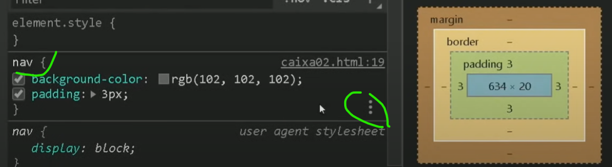
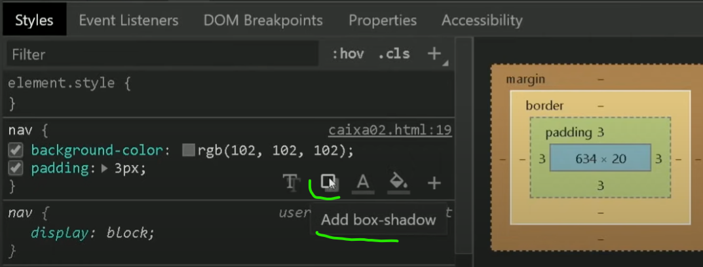
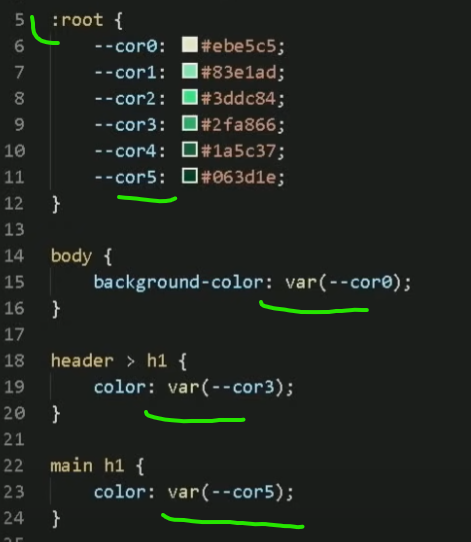
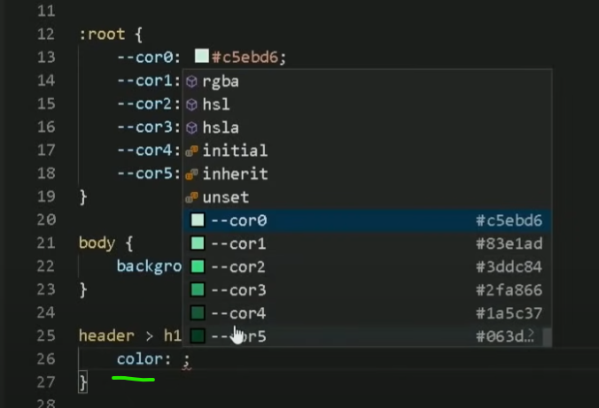
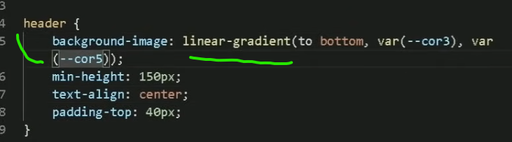
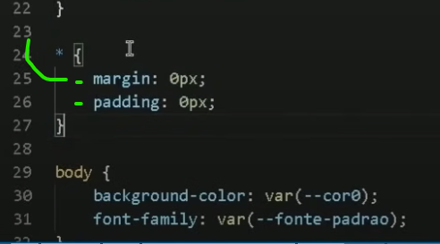
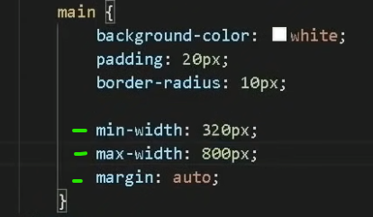
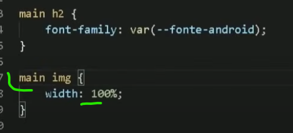
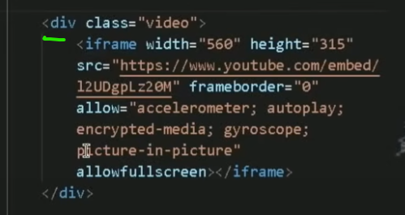
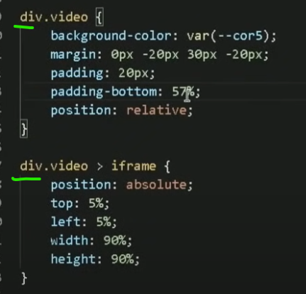

# 1 (TIG BASICOS PARA CSS)

* Al Trabajar con css es importante usar colores que hagan sentido unos con otros dependiendo del contraste.
    paginas utiles.      
    1 - Color.adobe.com = esencial para usar paletas de colores. conjuntos de colores que hacen armonia.
    2 - Paletton = te ayuda tambien a crear ideas para tonos de colores para sites.

* otra dica util, usar estencion en google Chrome - colorzilla.
 1 - Colorzilla, al instalarse aparece arriba en barra de navegacion. al clicar el te da la opcion de pegar el codigo exacto de cualquier color de un site que te guste sus tonos y obtener sus codigos rgb por ejemplo y usarlos para tu site.

* Dica (Colores degradados) - para colocar unas letras o fondo del site o etc.  Y COLOCAR LOS colores que quieras funcionar como degradados . . ejemplo
```html
<head> 
    <style> 
body {
    background-image: linear-gradient(to right #3198E2, #6D59c0 #E33F5F)
}
    </style>
</head>

```
* (Trabajando con tamaño de fontes "letras" delgadas a mas gordas.)

font-weight:  ;  = sirve especificamente para especificar cual grosor la letra tengra.   puede ser usado una de estas 4 opciones.

lighter - normal - bold - bolder

ejemplo..
```html

<head> 
  <style> 
font-weight: bold;
  </style>
</head>
```
* (Sites utiles para usar tipos de fontes.letras para site.)
1 - Google Fonts es esencial cuando quieres mudar el estilo de letras fonts de tu site. consiges todas la familia de fonts y pegas su codigo y lo colocas dentro de tu style css.

2 - dafont.com - Este site al bajar el archivo sipado de la fonte escogida algunas tienen distintos formatos ejemplo .otf  .ttf 

al colocarlos en style CSS Toca llamar la funcion ejemplo.
```html
<head> 
  <style> 
  @font-face{
              font-family: ; 
              src: url("nombre de fonte.otf") format("opentype"), url("nombre de la fonte") format("truetype")
              font-weight: normal;
}
  </style>
</head>
```
* estencion util para instalar. 
entrar chrome web store y instalar estencion Fonts ninja.   sirve para identificar fuentes de letras. 


# 2 (Editar contenido com CSS)

* Aliniamientos de Textos
```html
<head>
  <style> 
      body {
        text-align: left;  /*alinia texto a la isquierda */
        text-align: center; /*alinia texto al centro  */
        text-align: right; /*alinia texto a la derecha*/
        text-align: justify; /*fustifica o adacta el texto dependiendo del ancho de la pagina y espacio usado.*/
        text-indent: 30px; /*hace que el titulo o parrafo seleccionado comienze un poco mas a la Derecha*/
        tex-shadow: 2px 2px 0px black; /*Sombra en textos*/
         line-height: 3em; /*altura entre lineas.separacion de letras.*/
        
      }   
  </style>  
 </head>
```
# (Modificacion de "Caixas" h1,p,nav,div etc. Anatomia de Caixa.)
```html
<style>
  background-color: burlywood; /* Color de Fondo */
  height: 200px; /* Altura de la Div o <nav> etc */
  min-height: 150px; /*Altura minima. se usa para configurar por si se asiste desde un tlf o table se adapte a altura minima*/
  width: 200px;  /* Largura 0 Anchura*/
  border: 1px solid black; /* Genera bordes */
  border-radius: 5px; /* Genera bordes */
  boder-bottom-left-radius:10px; /*borda abajo isquierda */
  boder-bottom-right-radius:10px;/*borda abajo derecha*/
  padding: 3px;  /*"BORDA PARA DENTRO"crea un espacio entre el contenido sea text h1 o etc y espacio de del border. crea distancia entre la borda y el contenido. */
  padding-rigth 10px; /*borda de lado isquierdo, anchura*/
  padding-left: 10px; /*borda de lado derecho, anchura*/
  margin: 3px; /* "BORDA PARA FUERA" igual que padding pero al contrario. seria por fuera del Border. */
  outline: /*Es Otra Borda parecida a border solo que border es dentro del elemento. y Outline es trasado fuera del elemento. */
  display: inline-block; /* Inline block hace que todo el contenido se acomoden en la misma linea un al lado del otro. */
  tex-shadow: 2px 2px 0px black; /*Sombra en textos*/
  tex-indent: 20px; /*hace que el texto comience un poco a la derecha.*/
  text-align: center; /*centraliza contenido, letras, que esten dentro de la caja. sea h1, <p> etc.*/
  line-height: 3em; /*altura entre lineas.separacion de letras.*/
  transition-duration: 1s; /*al usar alguna funcion com hover de efecto al passar mause por ensima. y usar transition da para retrasar el efecto .5 segundos. 1s etc.*/


  /* FUENTRES - PARA CONFIGURACION DE LETRAS.  */

  font-size: 1em; /*da grosor o aumenta el tamanho de las letras. sea h1,p, etc.*/
  


  /*Configuraciones especificas. arriba, derecha, abajo, isquierda.*/

  /*Ejemplo - Margin:*/

  margin-top: 10px; /*margen arriba*/
  margin-right: 10px; /*margen derecha*/
  margin-bottom: 10px; /*margen abajo*/
  margin-left: 10px; /*margen isquierda*/
  margin: auto; /*si es una "caja" sea h1 div, p, etc. margen auto sirve para centralizar en el medio de la pantalla.*/

  /*Simplificar configuraciones de arriba, derecha,abajo, isquierda*/
  /* En Ves De Colocar por ejemplo configuracion de margin asi. 
     margin-top: 10px;
     margin-right: 10px;
     margin-bottom: 10px;
     margin-left: 10px;

      Da para Simplificar los Componentes de esta Forma 
    margin: 10px; = da 10px para los 4 margen.
    margin: 10px 15px 20px 10px; = o da para configurar un margen diferente para cada uno arriba Derecha, abajo, isquierda.
  */
</style>
```
* Sombras de Cajas - Para Area de Navegacion. Titilo h1, p, footer etc.
````html
<style>
  /*EJEMPLO EN div Nav colocando sombra en css.*/
    /* 1ER 1PX = Sombra orizontal*/
    /* 2do 1PX = Sombra vertical*/
    /* 3ER 1PX = Sombra espaciamiento*/
    /* 4to 1PX = Sombra General total*/
     nav {
      box-shadow: 1px 1px 1px black; /*Sombra de caja*/
      tex-shadow: 2px 2px 0px black; /*Sombra en textos*/
     }
</style>
```
```
````
* CONFIGURAR SOMBRAS CLICANDO EN IMPECIONAR BUSCAR EL AREA QUE QUIERES MODIFICAR LAS SOMBRAS CLICKAR EN LOS 3 PUNTICOS. Y LUEGO EN BOX-Shawow ejemplo..



* (Bordas - crear efectos redondados - tag border-radius)
```html
<style>
  footer {
      border-radius: 5px 5px 5px 5px;
  }
</style>
```


# (Usar id: y Class: en CSS.) 
* Recordar recla de id, Class, pSeudo-class, pSeudo-element
```html
<!--  # = id  -->
<!--  . = Class  -->
<!--  : = PSeudo-class  -->
<!-- :: = pSeudo-element  -->
```

* Al dar un identificador en html a algun 
```html
<h1> <p> <header> <nav> etc
  ejemplo - <h1 id="titulo1">
``` 
* sirve para usar esse identificador para Modificar especificamente ese contenido de ese h1 en especifico que tiene el id o Class.
```html
<header id="encabezado"> <!--en css al colocar el id creado = #encabezado{
                           } 
-->
  <nav Class="navegacion1">  <!--en css al colocar la Class creada = .navegacion1{
                               }
  -->
``` 
* Dica - usar Id Solo para una tag en especifica. cuando es para que varios titulos h1 o paragrafos etc al mismo tiempo para todos el mismo formato se usa Class.

# pSeudo-class - efectos etc.
* un id se vincula com un # 
* una classe se vincula com un .
* y una pseudo-class se usa para mejorar algun id o class sea div, nav, h1 etc colocando dos puntos, ejemplo div: 
al colocar : se activa las pseudo classes y tiene multiples opciones para Modificar la div o h1 etc y modificar su estado. para el estar activo, si está marcado. para abilidar o desabilitar etc.

* uno de las Pseudo-classes mas usados es :hover
* div:hover { 
   background-color: blue;   
}  = significa que la div va tener la configuracion de ser escuchada hover sirve para configurar sombras o colores para que cuando essa div en especifico se passe el mouse por encima reciva el efecto que a sido colocado en el div:hover [] por ejemplo.

# pSeudo-elementos. 
* pSeudo-elementos sirven como para adicionar un texto aparte sin tener que colocarlo en html. seria directamente dentro de CSS. 
EJEMPLO - al crear una tag "a" de link.  al Editar tu estilo color etc en css se coloca a {}   pero para usar las funciones de Pseudo-elemento seria con dos :: 
ejemplo - 
```html
<head>
    <!-- Lo que se coloca dentro de  a::after {
        content: "link"
      }     ejemplo "link" es el texto que aparecera adicional  en ves de "link" puedes digitar lo que quieras o algun simbolo o etc. -->  
    <style> 
      a::after {
        content: "link"
      }
    </style>  
</head>
```

# (Paleta de colores Crear configuracion de Colores hacer usados en el site.) Ejemplo.



# al crear el root: esas configuraciones de colores quedan salvas al usar el backgraound-color, o Color. y facilita todo al tener tu paleta de colores. ejemplo.


* (CREAR DEGRADADO CON PALETA DE COLORES.) PARA CUALQUIER AREA DE CAJA. SEA NAV HEADER H1 ETC. EJEMPLO...



# (dicas importantes)
* 1.  CUANDO EDITAR ESTILOS CONFIGURACIONES DENTRO DE CSS. 
*  Recordar que . * [] es para padronizar configuracion toda en general osea, * es para configuracion Global. se usa mucho para acabar o elimitar margenes generales de <p> <h1> etc que se crean automaticamentey genera espacios innecesarios ejemplo.> 



# (Responsividade para sites - tamanho de tela.)
* una de las formas es usar configuracion basica usando min-width: ;  y max-width: ;  calculando el valor deseado. 


* en caso de img en algunos casos con solo colocar (width: 100%) da para la imagen se adactar al tamanho grande y pequenho de tela configurado. ejemplo de Imagen em este caso la imagen esta dentro de la tag main por eso se coloca "main img"


# (Listas - Ul - Ol. Dicas-CSS) 
  ```html

  <style> /*PRESTAR Atencion en el Style- CSS*/

  list-style-position: inside; /*posicion de las Bolitas quedan en la parte de adentro de alguna Configuracion de fonte o si la lista esta dentro de un <asade> o footer etc los puntos de la lista puede que queden en la parte de afuara. en esse caso se usa list-style-position: inside;*/
  
  columns: 2; /*la list- generalmente se forma una sola Columna Larga dependiendo del contenido. con essa occion da para dividir las listas en varias Columnas*/

   </style>
  <body>
    <ul>
      <li>cebolla</li>
      <li>salsa</li>
      <li>papa</li>  
    </ul>

  </body>
  ```

  # (Responsividade - Videos.) 
  * videos de youtube ya vienen con Iframe pronto. y para modificar dentro de un site se necesita hacer unos truquitos. uno de ellos es primeramente colocar el iframe detro de una Div y dar una Class. para luego modificar en CSS. ejemplo.
  
  * luego de hacer eso. toca ir al CSS y hacer configuracion de la class video. y luego crear mas otra dentro de iframe; y hacer configuraciones basicas para la div de video que se creo. ejemplo.
  

  # proximo 


             
           

